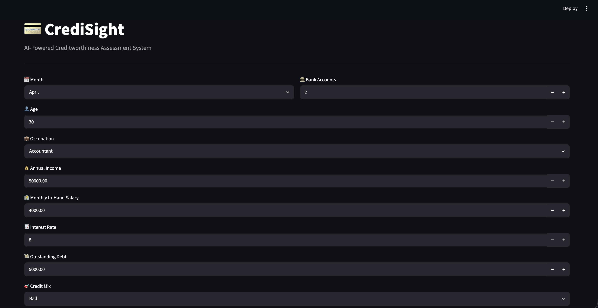
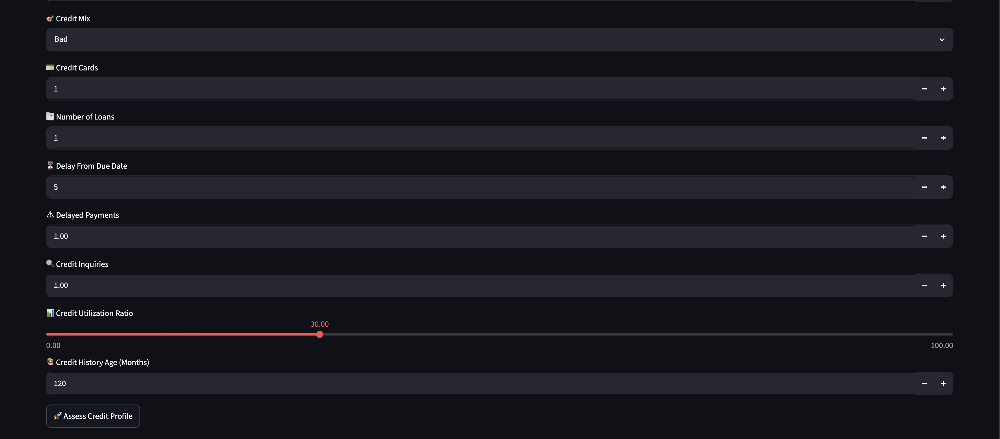
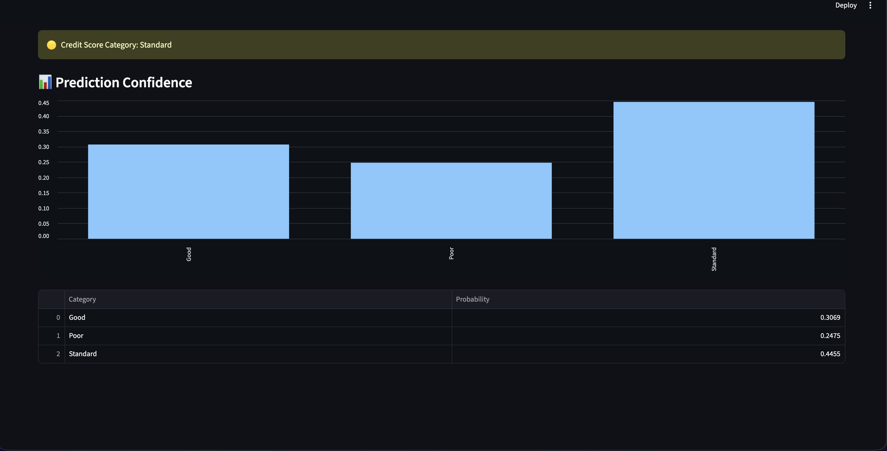

# 💳 CrediSight

An AI-powered Credit Score Classification System that predicts whether a customer's credit profile is **Good**, **Standard**, or **Poor** using Machine Learning.

Built using a Random Forest Classifier and deployed with Streamlit, CrediSight analyzes financial and behavioral indicators to assist in automated credit risk assessment.

---

## 🚀 Features

- Predicts customer credit score category
- Interactive web application built with Streamlit
- Handles missing values and noisy real-world financial data
- Feature engineering for improved model performance
- Confidence score visualization
- Trained on 100,000 customer credit records
- Real-time creditworthiness assessment

---

## 🧠 Machine Learning Pipeline

### Data Preprocessing

- Removed irrelevant identifiers
- Handled missing values
- Cleaned inconsistent numeric entries
- Converted credit history into numerical months
- Encoded categorical features
- Engineered additional financial indicators

### Model

- Algorithm: Random Forest Classifier
- Trees: 101
- Train-Test Split: 80:20
- Stratified Sampling
- Feature Importance Analysis

---

## 📊 Model Performance

| Metric | Score |
|----------|----------|
| Accuracy | 79.0% |
| Cross Validation Accuracy | 77.8% |
| Classes | Good, Standard, Poor |

---

## 🔍 Top Predictive Features

- Outstanding Debt
- Interest Rate
- Delay from Due Date
- Credit Mix
- Credit History Length
- Number of Credit Inquiries
- Monthly Balance
- Credit Utilization Ratio

---

## 🛠 Tech Stack

- Python
- Pandas
- NumPy
- Scikit-Learn
- Joblib
- Streamlit

---

## Running the Project

1. Clone the repository

```bash
git clone https://github.com/Aarusheee31/CrediSight.git
cd CrediSight
```

2. Install dependencies

```bash
pip install -r requirements.txt
```

3. Open `Cred_mod.ipynb` and run all cells to generate:

   * `creditiq_model.pkl`
   * encoder files

4. Launch the application

```bash
streamlit run app.py
```


## 📸 Demo

### Home Screen





### Prediction Result



## 👩‍💻 Author

**Aarushi Singh**

B.Tech Computer Science Engineering Student

Designed and developed CrediSight, an end-to-end credit score prediction platform trained on 100,000 customer records. The project combines data preprocessing, feature engineering, Random Forest classification, model evaluation, and Streamlit deployment to deliver real-time creditworthiness assessment.


---
